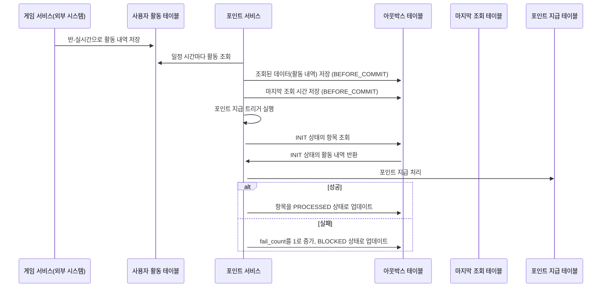

## 주요 기능

1. 트랜잭션 아웃박스 패턴 구현
- 트랜잭션이 성공적으로 커밋될 때만 외부 작업이 실행되므로, 데이터 일관성(Eventual Consistency)을 보장

2. 백그라운드 작업 스케줄링
- 백그라운드 스레드를 사용하여 실패한 작업을 재시도하거나 "데드 레터 큐" 상태로 관리

3. 유연한 직렬화
- 기본적으로 GSON을 사용하여 JSON 형태로 작업 데이터를 직렬화
- Jackson 또는 커스텀 직렬화 로직을 사용하여 보다 복잡한 객체를 처리할 수 있음

4. Idempotency 보호
- 동일한 요청이 여러 번 호출되더라도 중복 처리를 방지할 수 있는 기능을 제공
- uniqueRequestId()를 사용하여 요청의 고유 ID를 설정하고, 이전 요청과 비교하여 중복을 차단

5. "데드 레터 큐" 관리
- 실패 횟수가 일정 기준을 초과한 작업을 차단("Blocked") 상태로 설정
- 관리자 또는 운영팀이 작업을 검토하고 재시도를 트리거할 수 있음

---

## 유스케이스

1. 포인트가 지급되는 사용자의 활동 내역이 반 실시간(semi-synchronous)으로 저장
- 학습활동 저장 시 아웃박스와 분리(활동 내역 저장은 외부 시스템에 의해 관리)

2. 일정 시간마다 활동 내역을 조회해서 아웃박스 테이블에 저장 (BEFORE_COMMIT)
- 2-1) 아웃박스 테이블에 저장된 마지막 데이터의 로그 시간을 기준으로 활동 내역을 조회
- 2-2) 조회된 활동 내역을 아웃박스 테이블에 저장
- 만약, 중간에 서버가 다운되어 실패하더라도 다시 실행되면 중간 지점부터 실행됨

3. 아웃박스 테이블에 저장된 데이터를 기반으로 포인트를 지급
- 3-1) 하루에 한 번 포인트 지급을 실행
- 3-2) 포인트 지급이 완료되면 아웃박스 테이블에 처리 완료로 표시
- 중복 지급을 방지하기 위해 Idempotency를 보장해야 함
- 서버가 다운되어 실패되더라도 다시 실행되면 중간 지점부터 실행되도록 되어야 함
- 포인트 지급이 실패하면 재시도없이 fail_count가 1이되고, BLOCKED 상태로 변경

